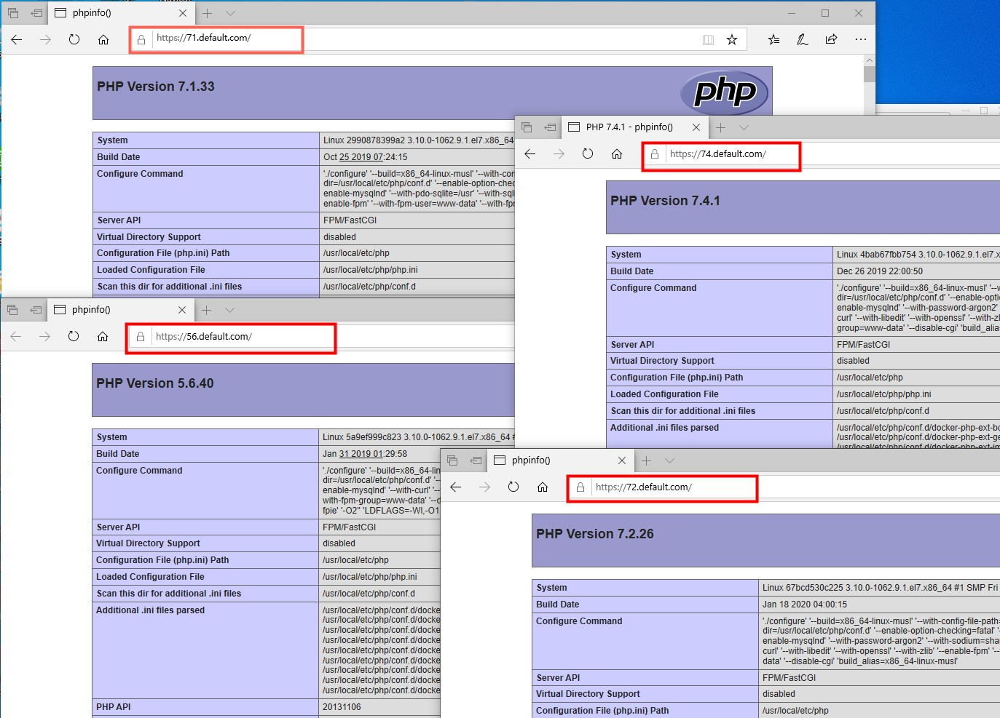

`HG_NAMPR`是一款全功能的docker一键部署套件。当前支持Nginx + Apache + PHP +MySQL 8 + Mongodb + Redis等，满足日常开发及生产环境使用。

即可满足本地开发环境的使用，亦可做为生产环境服务端的部署，同时也是学习docker编排的最好demo实例。

`PS：本项目在保证规范统一的大前提下，针对同一方式的，可能会故意使用不同写法，达到同样效果，目的就是为了便于有兴趣的同学，便于docker编排学习。`

### HG_NAMPR 项目特点：

1. `100%`开源，遵循Docker标准

2. 采用最新Docker版本制作

3. 支持**多版本PHP**共存，可任意切换（PHP7.2、PHP8.1、PHP8.2、PHP8.3...)

4. 默认php支持webp图片格式

5. 支持php常用热门扩展，如kafka、grpc, swoole、zookeeper等

6. 支持**HTTPS和HTTP/2**

7. 支持绑定**任意多个域名**

8. **PHP源代码、MySQL数据、配置文件、日志文件**路径均可根据需要自定义

9. 实际生产项目确保`100%`可用（相关配置可根据需要自行修改，详见conf目录）

10. 通过bg-sync进行访问加速，解决开发环境中项目运行缓慢情况


### 约定：
```
1、可选安装nginx或tengine(默认安装nginx)
   可选安装mysql模式（默认官方二进制文件安装，也可通过apt形式安装）

2、默认提供证书为*.default.com泛域名。如果作为本地开发环境使用，请根据当前约定，自行修改本机默认的hosts文件；
生产环境下使用，请修改.env和conf/conf.d下相关配置文件后，再执行安装，避免安装后的再调整。

3、vhost下的关于nginx和apache的vhost文件，根据需要请在执行安装前，自行删减，避免安装后nginx报错。

4、php默认采用mod_php模式，不提供php-fpm模式
   php-fpm: 使用FastCGI,php和apache分离;
   mod_php: php做为Apache一个内置模块

5、约定地址：
    php 5.6测试地址：https://56.default.com
    php 7.1测试地址：https://71.default.com
    php 7.2测试地址：https://72.default.com
    php 7.3测试地址：https://73.default.com
    php 7.4测试地址：https://74.default.com

5、为了提高国内下载构建速度，相关软件包全部放在根目录下的src下，请通过百度网盘下载后，放在根目录下即可。
  网盘下载链接：https://pan.baidu.com/s/1dkEz_BZJo1901fxWTFxiXA 提取码：6eao
```

# 1.效果演示：



# 2. 使用说明
1. 本地安装`git`、`docker`和`docker-compose`

    CentOS 7用户可以通过提供的centos7-optimizer.sh脚本一键安装

    Windows下安装docker-composer.exe: https://docs.docker.com/compose/install/

2. `clone`项目：
    ```
    $ git clone https://gitee.com/indextank/HG_NAMPR.git
    ```
3. 如果不是`root`用户，还需将当前用户加入`docker`用户组：
    ```
    $ sudo gpasswd -a ${USER} docker
    ```
4. 常用命令：
    > 为了强制docker构建镜像时不用缓存，执行带–no-cache参数的docker build命令
    > eg: docker-compose -f docker-compose-lnamp.yml build --no-cache python311

    4.1 创建并且启动所有容器 (-d，代表后台运行方式)
    ```
    $ docker-compose -f docker-compose.yml up -d
    $ DOCKER_BUILDKIT=0 docker-compose -f docker-compose-lnamp.yml up
    ```

    此种方式，不推荐~建议根据个人需要，启动相应的服务即可。比如启动nginx+mysql
    ```
    $ docker-compose up nginx mysql php80
    ```

    4.2 启动并进入单个容器
    ```
    $ docker run -it mysql:5.7 /bin/bash
    ```
    4.3 构建或者重新构建服务
    ```
    $ docker-compose build php72
    ```
    4.4 启动|停止|重启服务
    ```
    $ docker-compose start|stop|restart 服务1 服务2 ...
    或
    $ docker start|stop|restart  服务1 服务2 ...
    ```
    4.5 进入命令行容器
    ```
    $ docker-compose exec 服务 bash
    或
    $ docker exec -it 服务 /bin/sh
    ```
    4.6 停止并删除容器，网络，图像和挂载卷
    ```
    $ docker-compose down 服务1 服务2 ...
    ```
    4.7 删除容器
    ```
    $ docker-compose rm 容器ID
    ```
    4.8 删除镜像
    ```
    $ docker-compose rmi 镜像ID
    ```
    4.9 批量删除容器
    ```
    $ docker container rm --force $(docker container ls -a -q)
    ```
    4.10 批量删除镜像
    ```
    $ docker image rm $(docker image ls -a -q)
    ```
    4.11 批量删除无用镜象（三种方式都可以，想强制删除可在rmi后加-f）
    ```
    docker images | grep none | awk '{print $3}' | xargs docker rmi
    docker rmi $(docker images | grep "^" | awk "{print $3}")
    docker rmi $( docker images -f dangling=true)
    ```
    4.12 mac上安装docker-sync
    ```
    $ gem install docker-sync
    $ brew install fswatch
    $ brew install unison
    $ brew install eugenmayer/dockersync/unox
    $ echo 'export PATH="/usr/local/lib/ruby/gems/2.6.0/bin:$PATH"' >> ~/.bash_profile
    $ source ~/.bash_profile
    $ docker-sync start  或 docker-sync-stack start
    ```
    4.13 使用 docker-sync 让 Mac/Linux 和 docker 之间的文件同步变快【 仅支持Mac/Linux 】
    ```
    $ docker-compose -f docker-compose.yml -f docker-compose-$(uname -s).yml up
    ```
    4.14 以守护进程方式启动 【推荐使用】
    ```
    $ docker-sync-daemon start  && docker-compose up -d
    ```
    4.15 查看容器资源使用情况
    ```
    $ docker stats
    ```
    4.16 查看容器日志
    ```
    $ docker logs 8092585b0526 --follow

    # 返回最近30分钟内的日志信息
    $ docker logs --since 30m c774ed427ad3
    ```

# 3. 切换PHP版本？
切换PHP仅需修改相应站点 Nginx 配置的`proxy_pass`选项，
再重启 Nginx 和 php
生效
```
    $ docker-compose restart tengine php82_apache
```

# 4. 添加快捷命令
在开发的时候，我们可能经常使用docker exec -it切换到容器中，把常用的做成命令别名是个省事的方法。

Linux系统打开~/.bashrc (Mac OS系统打开~/.bash_profile)，加上：
```bash
alias dnginx='docker exec -it tengine /bin/sh'
alias dphp83='docker exec -it php83_apache /bin/bash'
alias dphp82='docker exec -it php82_apache /bin/bash'
alias dphp81='docker exec -it php81_apache /bin/bash'
alias dphp80='docker exec -it php80_apache /bin/bash'
alias dphp74='docker exec -it php74_apache /bin/bash'
alias dphp72='docker exec -it php72_apache /bin/bash'
alias dmysql='docker exec -it mysql /bin/bash'
alias dredis='docker exec -it redis /bin/bash'
alias dpostgre='docker exec -it postgresql /bin/sh'
```
然后执行
```
    source ~/.bashrc  或  source ~/.bash_profile
```
后期使用中，如果想进入容器，直接在终端输入别名即可。

# 5. 在正式环境中安全使用
要在正式环境中使用，请注意相关配置调整：
1. 在php.ini中关闭XDebug调试及错误级别(默认错误级别为ALL)
2. 增强MySQL数据库访问的安全策略
3. 增强redis访问的安全策略，默认bind为0.0.0.0

# 6. 使用Logs

默认所有日志，会全部归结到logs文件夹下各自的项目文件夹中，如果需要修改日志路径，请对应修改各自程序的配置文件即可。

如果需要实时查看docker镜像日志，也可以参考`4.16`命令查看。

# 7. 使用composer
dnmp默认已经在容器中安装了composer，使用时先进入容器：
```
$ docker exec -it php82 /bin/bash
```
然后进入相应目录，使用composer：
```
# cd /var/www/html/default
# composer update
```
因为composer依赖于PHP，所以，是必须在容器里面操作composer的。


## 常见问题
1. 如何开启本地https，且实现本地证书可信任

   `推荐使用mkcert，具体使用方式，可以自行搜索`

2. 安装的php版本没有怎么办？

    `针对过旧的php版本，可复制docker-compose.yml中php部分，直接粘贴修改即可`

    `最新版本的php，原则上也可以直接复制现有的配置文件，直接修改。`

## Author
作者：Euper

## License
GPL-3.0